# Hi! 👋

I am SW developer from Slovakia, specializing in modern C++ aps and ROS. I am interested in developing different kinds of SW in C++, Python and open source projects in this fields. 

## 📌 About Me:
- 💻 I specialize in **C++ (C++20/23), Python, ROS, CMake, Qt, Deep profiling and SW analysys**.
- 🔍 I enjoy working on **high-performance and cross platform apps**.
- 🎨 In my free time, I like **contributing to open-source projects and doing/creating tasks for CodeWars**.
- 🚀 I am always open to **collaborations** and seeking **new opportunities**!
- 🪪 My badge: 

## 🛠 Tech Stack:

## 📫 Contact Me:

